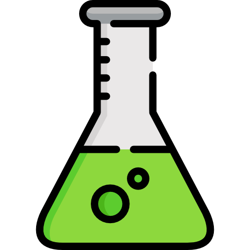
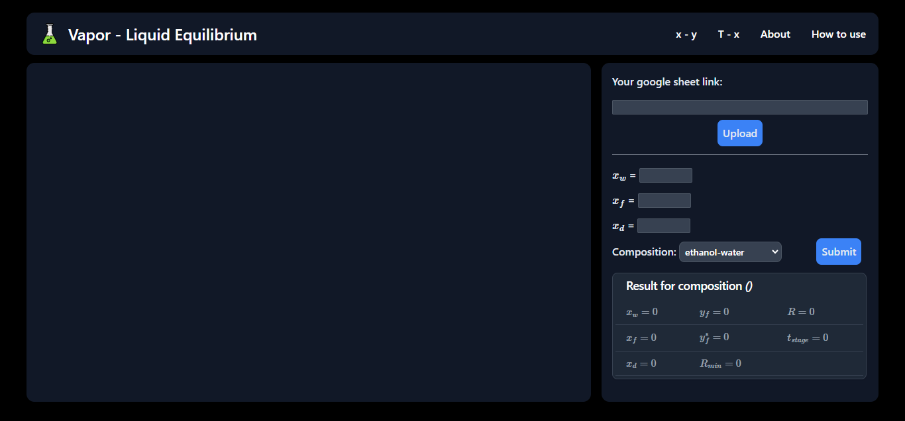

<a id="readme-top"></a>

<br />
<div align="center">
  <a href="https://github.com/tuanlearntocode/VLE">
    
  </a>

  <h3 align="center">VLE Diagram</h3>

  <p align="center">
    A project support for designing distillation collumn 
    <br />
    <a href="#"><strong>Explore the docs »</strong></a>
    <br />
    <br />
    <a href="https://vle-wzxu.onrender.com/">App view</a>
    ·
    <a href="#">Report Bug</a>
    ·
    <a href="#">Request Feature</a>
  </p>
</div>

<!-- TABLE OF CONTENTS -->
<details>
  <summary>Table of Contents</summary>
  <ol>
    <li>
      <a href="#about-the-project">About The Project</a>
      <ul>
        <li><a href="#built-with">Built With</a></li>
      </ul>
    </li>
    <li>
      <a href="#getting-started">Getting Started</a>
      <ul>
        <li><a href="#prerequisites">Prerequisites</a></li>
        <li><a href="#installation">Installation</a></li>
      </ul>
    </li>
    <li><a href="#usage">Usage</a></li>
    <li><a href="#license">License</a></li>
  </ol>
</details>

<!-- ABOUT THE PROJECT -->
## About The Project



VLE Diagram is a tool I used when solving distillation problem. Here the reason for this project:

* I was through a tough time dealing with this kind of chart using hand drawing and interpolate from it. The error could be enormous and affect later calculation 😕

* So I decide to implement while I had a course project about designing a distillation collumn. You can visually interact with the chart

* Data can be edited easily on the go 😲

<p align="right">(<a href="#readme-top">back to top</a>)</p>

### Built With

Project was built on main tech stack

<div align="center">
    <a href="https://flask.palletsprojects.com/en/3.0.x/" title="Flask">
    
    </a>
    <p>Flask</p>
    <br>
<a href="https://tailwindcss.com/" title="tailwind css">
    
  </a>
  <p>Tailwind CSS</p>

</div>

<p align="right">(<a href="#readme-top">back to top</a>)</p>

## Getting Started

Here is how you can set up to project on you local machine

### Prerequisites

You machine must have `python3` to continue. You can download and install at their [official page](https://www.python.org/downloads/) 

### Installation

_Below is the instruction how to run project on you local machine_

1. Clone the repo
    ```sh
    git clone https://github.com/tuanlearntocode/VLE
    ```

2. Install requirement file
    ```py
    pip install -r requirements.txt
    ```

3. (Optional) Turn on Flask debugger in `app.py`
   ```py
    if __name__ == "__main__":
        app.run(debug=True) # default is False
   ```
4. Run command
    ```py
    py app.py
    ```
   
5. Go to [http://127.0.0.1:5000](http://127.0.0.1:5000) to see the result

<p align="right">(<a href="#readme-top">back to top</a>)</p>

## Usage

Here is step by step to use :

1. Create a google sheet and set shared link with role "Editor"

2. Sheet name same as composition name

3. Add url to web and hit `Upload`

4. Fill $x_f, x_d, x_w$ field and hit `Submit`

5. The chart will show on the side and result at below

Here is example google sheet: [mysheet](https://docs.google.com/spreadsheets/d/1YZ-gdV_vQ2BtSbmC5peYVzub_rempUaZ/edit?gid=233341024#gid=233341024). You can follow this template.

<p align="right">(<a href="#readme-top">back to top</a>)</p>

<!-- LICENSE -->
## License

Distributed under the MIT License. See `LICENSE.txt` for more information.

<p align="right">(<a href="#readme-top">back to top</a>)</p>
